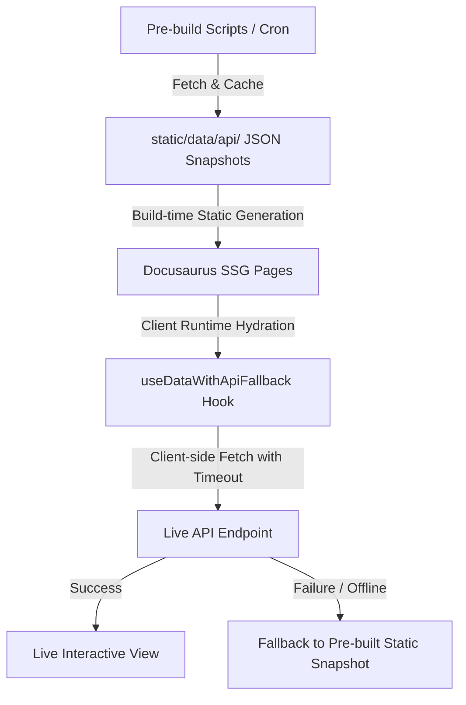

# RuyiSDK Website Architecture

## 1. Overview

The RuyiSDK website is built on [Docusaurus 3](https://docusaurus.io/) with React 18, Tailwind CSS, and custom SCSS. It serves documentation, release distribution portals, community statistics, news/weekly feeds, and an interactive packages index across multiple locales (`zh-Hans`, `en`, `de`).

## 2. Directory Structure

```
├── .github/
│   └── workflows/          # CI/CD workflows (check.yml, deploy.yml)
├── docs/                   # Git submodule: RuyiSDK documentation source
├── news/                   # Git submodules & articles
│   ├── articles/           # WeChat official accounts article markdown
│   ├── ruyinews/           # Git submodule: Packages-index news
│   └── weeklies/           # Git submodule: Bi-weekly reports
├── scripts/                # Build plugins, sync scripts, and maintenance CLI
│   ├── lib/                # Shared utilities (fetch-with-timeout, markdown-meta, etc.)
│   ├── plugins/            # Docusaurus plugins (news-generator, etc.)
│   └── README.md           # Documentation for all scripts
├── settings/               # Externalized configuration files
│   ├── community/          # Contributor filter rules
│   └── news-sources.json   # News source glob patterns and URL prefixes
├── src/
│   ├── components/         # Modular React components
│   │   ├── Dashboard/      # Telemetry & download statistics dashboard
│   │   ├── Docs/           # Custom CodeBlock, DocSearch, layout enhancements
│   │   ├── Downloads/      # Download cards, arch select modal, install scripts
│   │   ├── Home/           # Homepage hero, showcases, devboards, partners
│   │   ├── News/           # News timeline, articles, blogs, RSS subscription
│   │   └── PackagesIndex/  # Hardware and package compatibility explorer
│   ├── css/                # Global SCSS, custom variables, Infima overrides
│   ├── pages/              # Docusaurus page routes (index, news, downloads, etc.)
│   └── utils/              # Client-side utilities (date, img, locale, hooks)
├── static/                 # Static assets, images, API snapshots
│   └── data/api/           # Pre-built API data snapshots for static fallback
└── tests/
    └── unit/               # Vitest unit test suites
```

## 3. Data Flow & Resilience

The website employs a static-first data architecture:



1. **Build Time**: `scripts/generate-api-*.cjs` fetches remote endpoints (GitHub API, Ruyi backend) and saves JSON snapshots to `static/data/api/`.
2. **SSG Render**: Docusaurus renders HTML using the static JSON snapshots, ensuring the site builds and deploys even if backend APIs are temporarily unavailable.
3. **Client Hydration**: `useDataWithApiFallback` loads the bundled static snapshot immediately, then asynchronously checks the live API. If updated data arrives, it seamlessly refreshes without layout shift.

## 4. Internationalization (i18n)

- **Default Locale**: `zh-Hans` (Chinese)
- **Supported Locales**: `zh-Hans`, `en`, `de`
- **Translation Strategy**:
  - React components use `@docusaurus/Translate` and `getLocaleMessage()`.
  - News headlines and dates use `scripts/plugins/news-localize.cjs` and `src/utils/date.ts`.
  - Multi-locale routes are built using `docusaurus build --locale <locale>` in CI.
