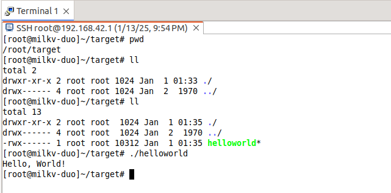

import CodeBlock from '@site/src/components/docs_utils/CodeBlock';

# Milkv Duo: Kompilierung, Ausführung und Debugging mit dem riscv64-unknown-linux-musl-bin Toolchain

## Aufbau der Entwicklungsumgebung

1. Installieren Sie den RuyiSDK Paketmanager [Referenz](/docs/Package-Manager/installation)
2. Installieren Sie den gnu-milkv-milkv-duo-musl Compiler

   <CodeBlock lang="bash" code={

   `   # Überprüfen Sie die Ressourcen des Software-Repositorys

      ruyi list

   

      # Installieren Sie die angegebene Toolchain

      ruyi install gnu-milkv-milkv-duo-bin

   

      # Aus den Rückgabedaten können Sie den Installationspfad einsehen, z.B. ~/.local/share/ruyi/binaries/x86_64/gnu-milkv-milkv-duo-bin-0.20240731.0+git.67688c7335e7`

   } />
3. Erstellen und verwenden Sie die Duo-Kompilierungsumgebung

   <CodeBlock lang="bash" code={

   `   # Überprüfen Sie die vordefinierten Umgebungen von ruyi

      # ruyi list profiles

   

      # Erstellen Sie eine virtuelle Umgebung: Toolchain ist gnu-milkv-milkv-duo-musl-bin

      ruyi venv -t gnu-milkv-milkv-duo-musl-bin milkv-duo ./venv-milkvduo`

   } />

## Entwicklung in der IDE

### Vorbereitung des Quellcodes

Dieser Artikel verwendet das Anwendungsbeispiel duo-examples des milkv-duo Entwicklungskits. Verwenden Sie eine der folgenden Methoden, um den Quellcode zu erhalten:

<CodeBlock lang="bash" code={

`# Methode 1: git clone

git clone https://github.com/milkv-duo/duo-examples.git

# Methode 2: ruyi extract Befehl herunterladen

ruyi extract milkv-duo-examples`

} />

### Importieren und Einstellen der Projekteigenschaften

1. Datei > Neu > Projekt

   
2. Wählen Sie C/C++ > Makefile-Projekt mit bestehendem Code > Weiter

   
3. Importieren Sie den vorbereiteten Quellcode:

   - Klicken Sie auf Durchsuchen > Ziel-Quellcode-Pfad
   - Toolchain für Indexer-Einstellungen: Wählen Sie RISC-V Cross GCC
   - Fertigstellen

   
4. Projekt hello-world > Rechtsklick > Eigenschaften konfigurieren

   1. Konfigurieren Sie den Toolchain-Pfad für das Projekt

      

      Wählen Sie den Pfad, in dem der Compiler zuvor mit ruyi install installiert wurde (standardmäßig im Pfad ~/.local/share/ruyi/binaries/x86_64/), oder das bin-Verzeichnis der erstellten virtuellen Umgebung;
   2. Setzen Sie die Kompilationseigenschaften

      
5. Bearbeiten Sie die Makefile

   - Der korrekte Betrieb des mitgelieferten Makefile des Projekts hängt von der vorherigen Einstellung der Umgebungsvariablen durch das Skript envsetup.sh ab. In der vorherigen [Dokumentationspraxis des Herstellers](https://github.com/milkv-duo/duo-examples/blob/main/README-zh.md) haben wir erfahren, dass der Compiler-Präfix, die Kompilierungsoptionen, die Linkparameter usw. im Voraus festgelegt wurden. Um die Handhabung zu erleichtern, werden diese Informationen in das Makefile geschrieben. Beachten Sie, dass der TOOLCHAIN_PREFIX-Pfad nach Bedarf geändert werden muss.
   - Kompilierungsparameter:
     - -mcpu=c906fdv: Gibt das Modell der Ziel-CPU beim Cross-Compiling an
     - -march=rv64imafdcv0p7xthead: Gibt die Zielarchitektur beim Cross-Compiling an
     - -g: Generiert Debugging-Informationen
   - Um die automatische Kopie vom Build zum Zielprogramm auf das Zielgerät zu realisieren, wurde im Makefile auch das Upload-Ziel hinzugefügt (dies setzt voraus, dass die SSH-Authentifizierung zwischen PC und Zielgerät abgeschlossen ist; bitte beachten Sie die "SSH-Schlüsselkonfiguration" am Ende). Außerdem müssen die entsprechenden Verzeichnisse auf dem Zielgerät im Voraus erstellt werden (der Speicherort kann angepasst werden, aber bitte ändern Sie den Pfad nach dem scp-Befehl, um sicherzustellen, dass er mit der tatsächlichen Umgebung übereinstimmt).
   - Sie können das folgende Makefile weiter anpassen; dieser Artikel bietet nur einen Referenzansatz.

   <CodeBlock lang="makefile" code={

   `   # Eclipse Toolchain Einstellungen

      #TOOLCHAIN_PREFIX := ~/milkv/duo/duo-examples/host-tools/gcc/riscv64-linux-musl-x86_64/bin/riscv64-unknown-linux-musl-

      TOOLCHAIN_PREFIX := ~/.local/share/ruyi/binaries/x86_64/gnu-milkv-milkv-duo-musl-bin-0.20240731.0+git.67688c7335e7/bin/riscv64-unknown-linux-musl-

   

      # Kompilierungsoptionen -O3  

      #CFLAGS := -mcpu=c906fdv -march=rv64imafdcv0p7xthead -mcmodel=medany -mabi=lp64d -DNDEBUG -I/home/phebe/milkv/duo/duo-examples/include/system

      #LDFLAGS := -D_LARGEFILE_SOURCE -D_LARGEFILE64_SOURCE -D_FILE_OFFSET_BITS=64 -L/home/phebe/milkv/duo/duo-examples/libs/system/musl_riscv64

      CFLAGS := -mcpu=c906fdv -march=rv64imafdcv0p7xthead -g  #-mcpu=c906fdv -march=rv64imafdcv0p7xthead : Eines von beiden muss gesetzt werden

      LDFLAGS := 

   

      TARGET=helloworld

   

      ifeq (,$(TOOLCHAIN_PREFIX))

      $(error TOOLCHAIN_PREFIX ist nicht gesetzt)

      endif

   

      ifeq (,$(CFLAGS))

      $(error CFLAGS ist nicht gesetzt)

      endif

   

      CC = $(TOOLCHAIN_PREFIX)gcc

   

      SOURCE = $(wildcard *.c)

      OBJS = $(patsubst %.c,%.o,$(SOURCE))

   

      # Standardziel

      all: $(TARGET)

   

      $(TARGET): $(OBJS)

      	$(CC) $(CFLAGS) -o $@ $(OBJS) $(LDFLAGS)

   

      %.o: %.c

      	$(CC) $(CFLAGS) -o $@ -c $<

   

      # Upload-Ziel

      upload: $(TARGET)

      	scp $(TARGET) root@192.168.42.1:/root/target/$(TARGET)

   

      .PHONY: clean upload

      clean:

      	rm -f *.o $(TARGET)

   

      # Lassen Sie das 'all' Ziel von 'upload' abhängen, um es nach dem Build automatisch hochzuladen

      all: upload`

   } />
6. Öffnen Sie das Terminalfenster in der IDE und erstellen Sie ein SSH-Terminal, um sich bequem in das Zielgerät einzuloggen und relevante Operationen durchzuführen. Wenn nötig, können Sie auch ein zusätzliches lokales Terminalfenster erstellen. Dies hängt von Ihren persönlichen Vorlieben ab. Die spezifischen Schritte sind:

   - Fenster > Ansicht anzeigen > Terminal
   - Terminal: Öffnen Sie eine neue Terminalansicht / Öffnen Sie ein Terminal > SSH-Terminal > Geben Sie Host, Benutzer, Passwort (das root-Passwort von milkvduo ist: milkv) gemäß dem Bild unten ein

     

     

     

     
   - Erstellen Sie im Voraus den Übertragungsweg für die Zieldatei gemäß dem Pfad im scp-Befehl im Makefile. (Nach dem Build wird das Zielprogramm im Verzeichnis erscheinen)

     

### Ausführung des Builds

Nachdem Sie die oben genannten Konfigurationen und Änderungen vorgenommen haben, klicken Sie mit der rechten Maustaste auf das Projekt und wählen Sie "Projekt erstellen". Wenn der Build erfolgreich ist:

1. Das Konsolenfenster zeigt keine Fehler an

   
2. Im SSH-Terminalfenster können Sie das erfolgreich übertragene Zielprogramm helloworld sehen

   

### Übertragung des Zielprogramms auf das Zielgerät

- Wenn im Makefile das Upload-Ziel definiert ist, wurde das Zielprogramm bereits während des oben genannten "Projekt erstellen" übertragen.
- Wenn im Makefile das Upload-Ziel nicht definiert ist, können Sie den Befehl `scp helloworld root@192.168.42.1:/root/target/` manuell ausführen, um das Zielprogramm zu übertragen.

### Ausführung des Zielprogramms und Rückmeldung der Ausführungsergebnisse

In der IDE gibt es verschiedene Möglichkeiten, das Zielprogramm auszuführen. Sie können je nach Gewohnheit und Bedarf wählen. Hier sind einige Methoden, die ich ausprobiert habe; weitere Methoden sind herzlich willkommen, gemeinsam erkundet zu werden.

#### SSH-Terminal

Sie können das Zielprogramm helloworld im SSH-Terminalfenster anzeigen und ausführen:

#### C/C++ Remote-Anwendung

Vorgehensweise: Rechtsklick auf das Projekt > Ausführen als > Ausführungs-Konfigurationen > C/C++ Remote-Anwendung

Vergleichen Sie die folgenden Bilder (die Bilder sind im Debug-Modus aufgenommen; da die Konfigurationen identisch sind, werden die Punkte anhand des Debug-Bildes erläutert), und passen Sie die relevanten Parameter an, wobei die folgenden Punkte wichtig sind:

- Projekt: Standardmäßig der Name des Zielprogramms
- C/C++ Anwendung: Auch standardmäßig der Name des Zielprogramms (Suchprojekt zur Abfrage)
- Verbindung: Neu > SSH
- Remote-Absolute-Dateipfad für C/C++ Anwendung: Geben Sie die absolute Adresse des Zielprogramms auf dem RISC-V-Gerät ein (in diesem Beispiel muss dies mit dem Pfad im scp-Befehl im Makefile übereinstimmen)
- Zielpfad-Download überspringen: In der aktuellen Version wird empfohlen, dies zu aktivieren und zusammen mit dem im Makefile definierten Upload-Ziel zu verwenden, um das Zielprogramm vom Host auf das Ziel-Entwicklungskit zu übertragen. Dies liegt daran, dass ohne Aktivierung das IDE das RSE (Remote System Explorer) Plugin installieren muss und das Zielgerätesystem sftp-server unterstützen muss. Derzeit unterstützt milkvduo kein sftp-server, daher ist diese Funktion vorübergehend nicht verfügbar.

Ausführungsbeispiel:

- [Erfolgreiche Ausführung mit aktivierter Option "Zielpfad-Download überspringen"](image/run1.gif)
- [Fehler bei der Ausführung ohne Aktivierung der Option "Zielpfad-Download überspringen"](image/run1.gif)

  > Das milkv duo-Image unterstützt derzeit kein sftp: https://github.com/milkv-duo/duo-buildroot-sdk/issues/167. Dieses Problem kann behoben werden, wenn das milkvduo-Image sftp-server unterstützt.
  >

### Debugging

#### Vorbereitung des Debugging-Beispiels

Die Debugging-Ergebnisse des helloworld-Beispiels sind nicht optimal. Um die Funktionen des Debuggings, des Setzens von Haltepunkten und des schrittweisen Verfolgens zu demonstrieren, verwenden wir hier ein anderes Beispiel.

sumdemo.c

<CodeBlock lang="c" code={

`#include <stdio.h>

int Sum(int s, int e)

{

    int result = 0;

    for(int i = s; i <= e; i++)

    {

        result += i;

    }

    return result;

}

int main()

{

    int start = 1;

    int end = 10;

    printf("Ich werde beginnen\\n");

    int n = Sum(start, end);

    printf("Ausführung abgeschlossen, Ergebnis ist: [%d-%d]=%d\\n", start, end, n);

    return 0;

}`

} />

Makefile:

<CodeBlock lang="makefile" code={

`# Eclipse Toolchain Einstellungen

#TOOLCHAIN_PREFIX := ~/milkv/duo/duo-examples/host-tools/gcc/riscv64-linux-musl-x86_64/bin/riscv64-unknown-linux-musl-

TOOLCHAIN_PREFIX := ~/.local/share/ruyi/binaries/x86_64/gnu-milkv-milkv-duo-musl-bin-0.20240731.0+git.67688c7335e7/bin/riscv64-unknown-linux-musl-

# Kompilierungsoptionen -O3   -static

#CFLAGS := -mcpu=c906fdv -march=rv64imafdcv0p7xthead -mcmodel=medany -mabi=lp64d -DNDEBUG -I~/milkv/duo/duo-examples/include/system

#LDFLAGS := -D_LARGEFILE_SOURCE -D_LARGEFILE64_SOURCE -D_FILE_OFFSET_BITS=64 -L/home/phebe/milkv/duo/duo-examples/libs/system/musl_riscv64

CFLAGS := -march=rv64imafdcv0p7xthead -g 

LDFLAGS := 

TARGET=sumdemo

ifeq (,$(TOOLCHAIN_PREFIX))

$(error TOOLCHAIN_PREFIX ist nicht gesetzt)

endif

ifeq (,$(CFLAGS))

$(error CFLAGS ist nicht gesetzt)

endif

CC = $(TOOLCHAIN_PREFIX)gcc

SOURCE = $(wildcard*.c)

OBJS = $(patsubst%.c,%.o,$(SOURCE))

# Standardziel

all: $(TARGET)

$(TARGET): $(OBJS)

   $(CC)$(CFLAGS) -o $@$(OBJS)$(LDFLAGS)

%.o: %.c

   $(CC)$(CFLAGS) -o $@ -c $<

# Upload-Ziel

upload: $(TARGET)

   scp $(TARGET) root@192.168.42.1:/root/target/$(TARGET)

.PHONY: clean upload

clean:

   rm -f *.o $(TARGET)

# Lassen Sie das 'all' Ziel von 'upload' abhängen, um es nach dem Build automatisch hochzuladen

all: upload`

} />

#### Vorbereitung des gdbserver

Das Original-Buildroot-Image enthält keinen gdbserver. Sie können die ausführbare Datei des Original-gdbserver kopieren oder ein neu gebautes Image mit dem RuyiSDK hinzufügen.

1. Laden Sie das Original-gdbserver-Executable herunter: https://github.com/milkv-duo/duo-buildroot-sdk/blob/develop/ramdisk/rootfs/public/gdbserver/riscv_musl/usr/bin/gdbserver
2. Kopieren Sie das heruntergeladene gdbserver in den Pfad des milkv duo Geräts:

   <CodeBlock lang="bash" code={

   `   scp gdbserver root@192.168.42.1:/usr/bin/

   

      ssh root@192.168.42.1 "chmod +x /usr/bin/gdbserver"`

   } />

#### Debugging im Terminal

Diese Vorgehensweise ist vergleichbar mit dem Debugging über das Terminal des Betriebssystems. Gewohnte Benutzer von Befehlen können dies ausprobieren.

Das Terminal unterstützt verschiedene Methoden wie Local Terminal und SSH Terminal. Sie können gleichzeitig ein Local Terminal und ein SSH Terminal mit milkv duo öffnen, um Operationen durchzuführen.

Die Schritte für das Remote-Debugging mit GDBServer + GDB-Befehlen sind wie folgt:

1. Auf der milkvduo-Geräteseite (im Verzeichnis von helloworld ausführen):

   <CodeBlock lang="bash" code={

   `   [root@milkv-duo]~/target# gdbserver :2345 ./sumdemo

      Prozess ./sumdemo erstellt; pid = 1802

      Lauschen auf Port 2345`

   } />
2. Auf der PC-Seite (im Verzeichnis von helloworld.c ausführen):

   <CodeBlock lang="bash" code={

   `   cd ~/ews-milkvduo-t01/sumdemo

   

      # Überprüfen Sie die gdb-Version und starten Sie das Debugging

      # Hier verwenden wir die ruyi virtuelle Umgebung für das Debugging, aktivieren Sie die virtuelle Umgebung und kompilieren Sie in der virtuellen Umgebung

      source ~/venv-milkvduo/bin/ruyi-activate 

      riscv64-unknown-linux-musl-gdb --version

      riscv64-unknown-linux-musl-gdb ./sumdemo

   

      target remote 192.168.42.1:2345   # Die Portnummer muss mit der des gdbserver übereinstimmen

   

      break sumdemo.c:8                 # Setzen Sie einen Haltepunkt in Zeile 8

   

      # Die folgenden Befehle sind möglicherweise nützlich, verwenden Sie sie nach Bedarf

      c                                 # continue, setzen Sie die Programmausführung fort, bis der nächste Haltepunkt erreicht wird

      disp result                       # Verfolgen Sie eine Variable, um ihren Wert bei jedem Haltepunkt anzuzeigen

      print result                      # Drucken Sie die interne Variable result`

   } />

[Local Terminal + SSH Terminal | GDBServer + GDB Debugging-Demonstration](image/gdb-terminal-1.gif)

#### C/C++ Remote-Anwendung

Vergleichen Sie die folgenden Bilder und passen Sie die relevanten Parameter an, wobei die folgenden Punkte wichtig sind:

- Projekt: Standardmäßig der Name des Zielprogramms
- C/C++ Anwendung: Auch standardmäßig der Name des Zielprogramms (Suchprojekt zur Abfrage)
- Verbindung: Neu > SSH
- Remote-Absolute-Dateipfad für C/C++ Anwendung: Geben Sie die absolute Adresse des Zielprogramms auf dem RISC-V-Gerät ein (in diesem Beispiel muss dies mit dem Pfad im scp-Befehl im Makefile übereinstimmen)
- Zielpfad-Download überspringen: In der aktuellen Version wird empfohlen, dies zu aktivieren und zusammen mit dem im Makefile definierten Upload-Ziel zu verwenden, um das Zielprogramm vom Host auf das Ziel-Entwicklungskit zu übertragen. Dies liegt daran, dass ohne Aktivierung das IDE das RSE (Remote System Explorer) Plugin installieren muss und das Zielgerätesystem sftp-server unterstützen muss. Derzeit unterstützt milkvduo kein sftp-server, daher ist diese Funktion vorübergehend nicht verfügbar.
- Debugger > Haupt > GDB-Debugger: Geben Sie den Pfad zu GDB an. In diesem Beispiel verwenden wir `~/.local/share/ruyi/binaries/x86_64/gnu-milkv-milkv-duo-musl-bin-0.20240731.0+git.67688c7335e7/bin/riscv64-unknown-linux-musl-gdb`
- Debugger > GDB > GDBserver-Einstellungen: Geben Sie GDBServer und den Kommunikationsport an

Wie bei der Ausführung ist die Funktion zur Fernübertragung des Zielprogramms derzeit aufgrund der fehlenden Unterstützung von sftp-server auf milkv duo nicht verfügbar, was zu folgendem Fehler führt.

Durch Aktivieren der Option "Zielpfad-Download überspringen" können Sie dieses Problem umgehen. In Kombination mit der Upload-Definition im Makefile wird das Zielprogramm bereits während der Build-Phase vom Host auf das Zielgerät übertragen.

Ausführungsbeispiel:

- [Fehler bei der Ausführung ohne Aktivierung der Option "Zielpfad-Download überspringen"](image/gdb-withdownload.gif)
- [Erfolgreiche Ausführung mit aktivierter Option "Zielpfad-Download überspringen"](image/gdb-withoutdownload.gif)

## Zusätzliche Hinweise

### SSH-Schlüsselkonfiguration

Hier wird die SSH-Schlüsselkonfiguration im Detail erläutert:

Durch die Konfiguration von ssh-key für den Host und milkv duo zur passwortlosen Anmeldung wird erreicht, dass die Binärdateien nach dem Build automatisch an den angegebenen Pfad auf milkv duo übertragen werden.

    1. Führen Sie auf dem Host ssh-keygen aus

    2. Fügen Sie den öffentlichen Schlüssel zu milkv duo hinzu:

    <CodeBlock lang="bash" code={

    `    #cat ~/.ssh/id_rsa.pub | ssh username@milkv_duo_ip_address 'mkdir -p ~/.ssh && cat >> ~/.ssh/authorized_keys'

    

        cat ~/.ssh/milkvduo.pub | ssh root@192.168.42.1 'mkdir -p ~/.ssh && cat >> ~/.ssh/authorized_keys'`

    } />

    3. Überprüfen: ssh root@192.168.42.1

    Im Erfolgsfall ist es nicht mehr erforderlich, ein Passwort einzugeben.