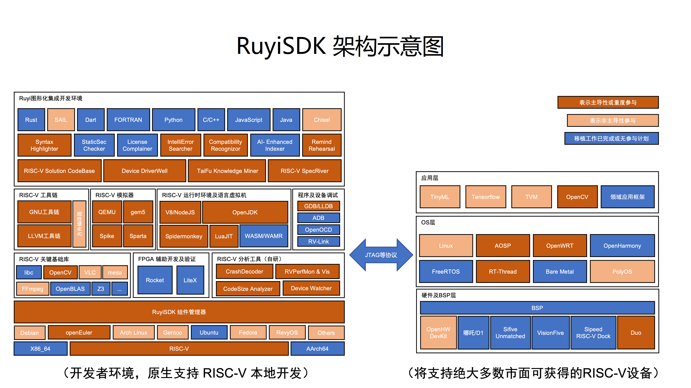

# Hello Ruyi

Willkommen bei der Einführung zu [RuyiSDK](https://github.com/ruyisdk). Im Folgenden finden Sie die relevanten Inhalte dieses Dokuments:

> 1. Was ist RuyiSDK? -> Einführung
> 2. Warum gibt es RuyiSDK? -> Hintergrund
> 3. Wofür ist RuyiSDK nützlich? -> Funktionen
> 4. Auf welchen Geräten kann ich es ausführen? -> Unterstützte Geräte
> 5. Wie funktioniert RuyiSDK? -> RuyiSDK-Architekturdiagramm
> 6. Wo soll ich anfangen? -> Lasst uns beginnen!

## Einführung

RuyiSDK ist ein Open-Source-Projekt, das vom [PLCT Lab](https://plctlab.org/) initiiert wurde. Das Projekt zielt darauf ab, RISC-V-Entwicklern eine benutzerfreundliche und umfassende Entwicklungsumgebung bereitzustellen. Es bietet aktuelle Informationen zu Hardware und Softwareunterstützung, wie z.B. die unterstützten Geräte. Auf der Softwareebene werden Images (z.B. [RevyOS](https://github.com/ruyisdk/revyos)), Toolchains, Paketmanager und mehr bereitgestellt.

Das ultimative Ziel ist es, RISC-V-Entwicklern eine vollständige und benutzerfreundliche Entwicklungsumgebung zu bieten, damit RISC-V zu einer Mainstream-Architektur wird. Zudem soll eine lebendige Community aufgebaut und betrieben werden, um den Austausch zwischen Entwicklern zu fördern. Langfristig soll RuyiSDK internationalisiert werden, um RISC-V-Entwicklern weltweit eine effiziente Entwicklungsplattform zu bieten.

## Hintergrund

RISC-V ist die fünfte Generation der reduzierten Befehlssatzarchitektur (RISC) und ein Open-Source-Projekt, das von der University of California, Berkeley, ins Leben gerufen wurde. Im Vergleich zu CISC (Complex Instruction Set Computing) ist RISC-V schlanker und bietet eine höhere Befehlsausführungseffizienz. Dank seiner Open-Source-Natur kann es in verschiedenen Bereichen wie IoT, Smart Home, Chipdesign, Betriebssystemen und Softwareentwicklung eingesetzt werden.

Ein Problem bei der bisherigen Entwicklung für RISC-V war das Fehlen einer zentralen Plattform für relevante Informationen. Dies führte dazu, dass die Effizienz von der ersten Lernphase bis zur Entwicklung von Anwendungen erheblich beeinträchtigt wurde. RuyiSDK wurde entwickelt, um diese Probleme zu lösen.

## Funktionen


RuyiSDK besteht aus den folgenden drei Teilen:

### [Ruyi Paketmanager](/docs/category/ruyi-包管理器)

Der Paketmanager ist eine Online-Softwarequelle, die folgende Inhalte bereitstellt:

```
1. Toolchains
2. Debugging-Tools
3. Emulatoren
4. Laufzeitumgebungen
5. Dokumentation
6. Quellcode
7. Tools und Systemimages
8. GUI (TODO)
```

### [Ruyi IDE](/docs/category/ruyisdk-ide)

Diese IDE ist ein Entwicklungstoolkit, das speziell für die RISC-V-Architektur entwickelt wurde. Entwickler können es einfach über den Ruyi-Paketmanager beziehen und es für die Codeerstellung und das Debugging in realen Entwicklungsszenarien verwenden. Mit dem Paketmanager können Entwickler die Toolchain, Debugging-Tools und Emulatoren aus dem Toolkit beziehen. Entwickler können den Emulator oder RISC-V-Entwicklungsboards verwenden, um ihre Programme zu schreiben und zu debuggen.

### [Community](/contact)

In unserer Community bieten wir eine Vielzahl von technischen Artikeln, Codebeispielen, Tutorial-Videos und veranstalten regelmäßig Offline-Events, um Feedback von Nutzern zu erhalten. Online steht ein Forum zur Verfügung, in dem Entwickler sich austauschen können.

----

Die Integration und Unterstützung von RISC-V-Geräten durch RuyiSDK umfasst die folgenden Aspekte:

1. Informationen zu RISC-V-Entwicklungsboard-Images sowie Download- und Installationsanleitungen, um Entwicklern den Zugriff auf relevante Images zu erleichtern (d.h. es wird ein Image-Repository bereitgestellt). Dies umfasst verschiedene Betriebssysteme wie das Debian-basierte RevyOS, openEuler RISC-V und mehr.
2. Bereitstellung von Demonstrationsprogrammen, Entwicklungsmaterialien und relevanten Tools (einschließlich geeigneter Toolchains und Emulatoren) für RISC-V-Entwicklungsboards, um Entwicklern den schnellen Einstieg zu ermöglichen.
3. Integration von RISC-V-spezifischen Assistentenseiten in die Entwicklungsumgebung, Unterstützung der Dateiübertragung zwischen Entwicklungs- und Laufzeitumgebungen sowie die Möglichkeit, Anwendungen auf RISC-V-Geräten zu debuggen.

## Unterstützte Geräte

Derzeit unterstützt RuyiSDK die folgenden [Geräte](https://github.com/ruyisdk/support-matrix):

| Modell                         |                      |                          |                     |
| ----------------------------- | -------------------- | ------------------------ | ------------------- |
| 100ASK-V853-PRO               | AllWinner V853       | BananaPi BPI-F3          | BeagleV-Ahead       |
| BeagleV-Fire                  | CanMV K230(D)        | Canaan K510-CRB-V1.2 KIT | CH32V103-EVT        |
| CH32V203-EVT                  | CH32V208-EVT         | CH32V303-EVT             | CH32V305-EVT        |
| CH32V307-EVT                  | CH573F-EVT           | CH582F-EVT               | CH592X-EVT          |
| D1s NeZha                     | DongshanPI-Nezha STU | DongShanPI D1s           | HiFive Unmatched    |
| Lichee Cluster 4A             | Lichee Console 4A    | LicheePi 4A              | LicheeRV/AWOL Nezha |
| LicheeRV Nano                 | Longan Nano          | MangoPi MQ               | MangoPi MQ Pro      |
| Milk-V Duo 64M                | Milk-V Duo 256M      | Milk-V Duo S             | Milk-V Mars         |
| Milk-V Meles                  | Milk-V Vega          | Nuclei DDR200T           | Pioneer Box         |
| PolarFire FPGA SoC Icicle Kit | RV-STAR              | Sipeed Maix-Bit          | Sipeed M0 sense     |
| Sipeed M0P Dock               | Sipeed M0s Dock      | Sipeed M1s Dock          | Star64              |
| Tang Mega 138K                | TinyVision           | VisionFive               | VisionFive 2        |
| YuzukiHD-Lizard               |                      |                          |                     |

> Die Dokumentation wird möglicherweise nicht immer aktuell gehalten. Um die neuesten unterstützten Geräte zu überprüfen, verwenden Sie den Befehl `ruyi device provision`.

## RuyiSDK-Architekturdiagramm



## Lasst uns beginnen!

Beginnen Sie mit RuyiSDK und Ihrem Gerät!

### Ruyi herunterladen und installieren

Weitere Informationen finden Sie [hier](/docs/Package-Manager/installation).

### Betriebssystem herunterladen und installieren

Der erste Schritt:

```bash
$ ruyi device provision
```

> Dieser Befehl erkennt die Hardwareinformationen und beginnt automatisch mit der Bereitstellung der RISC-V-Entwicklungsumgebung. Folgen Sie einfach den Anweisungen.

Weitere Informationen finden Sie unter [Entwicklungsboard-Flash mit dd (am Beispiel von MilkV Duo)](/docs/Package-Manager/cases/case3) und [Entwicklungsboard-Flash mit fastboot (am Beispiel von Licheepi 4A)](/docs/Package-Manager/cases/case4).