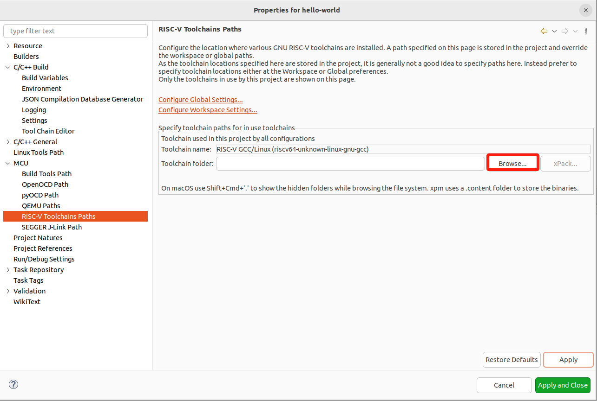
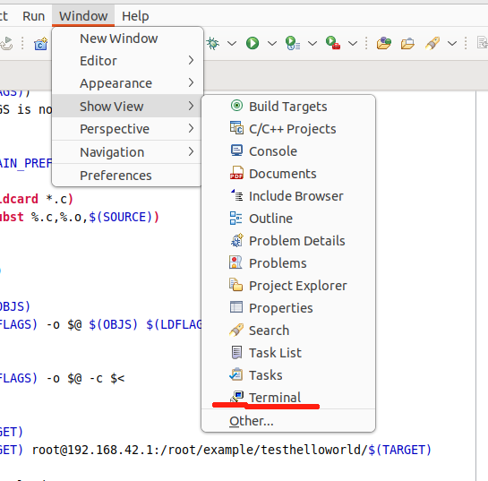
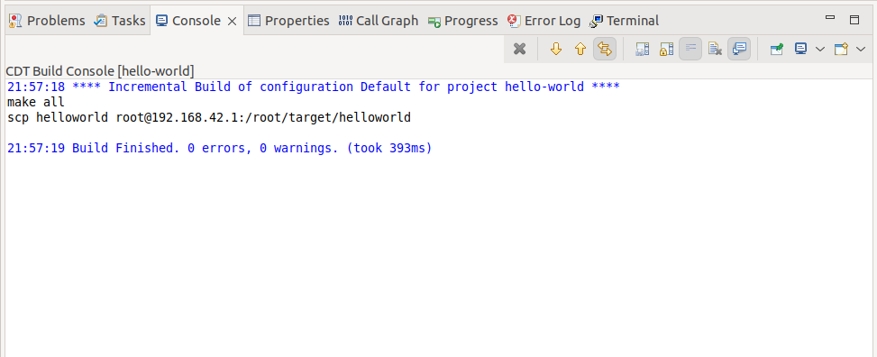
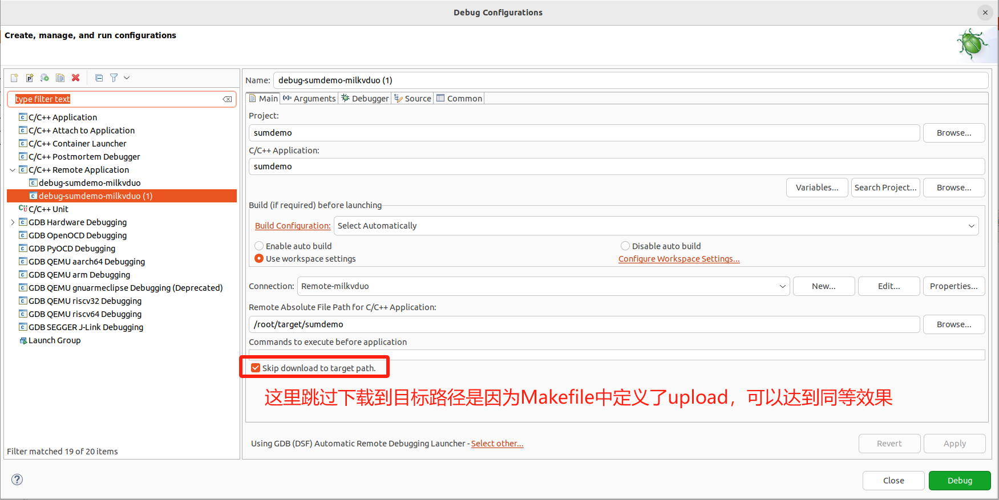
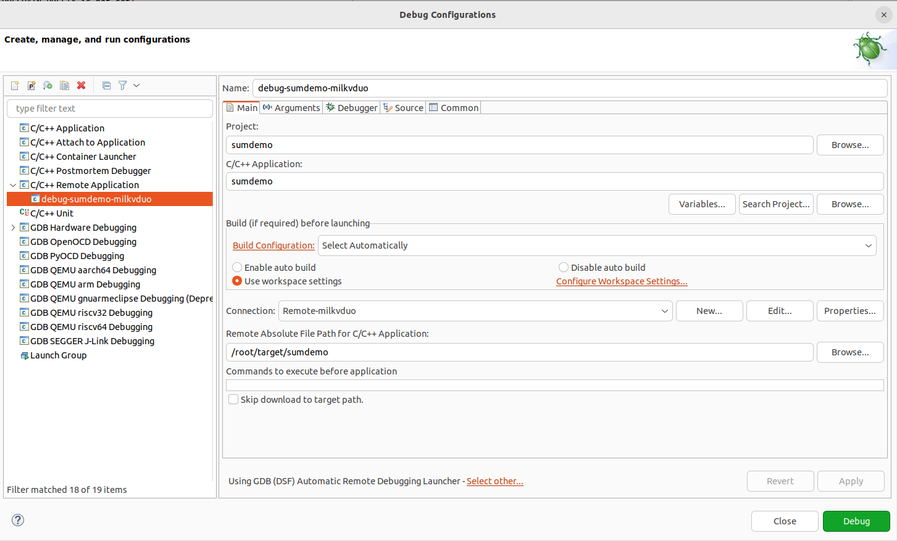
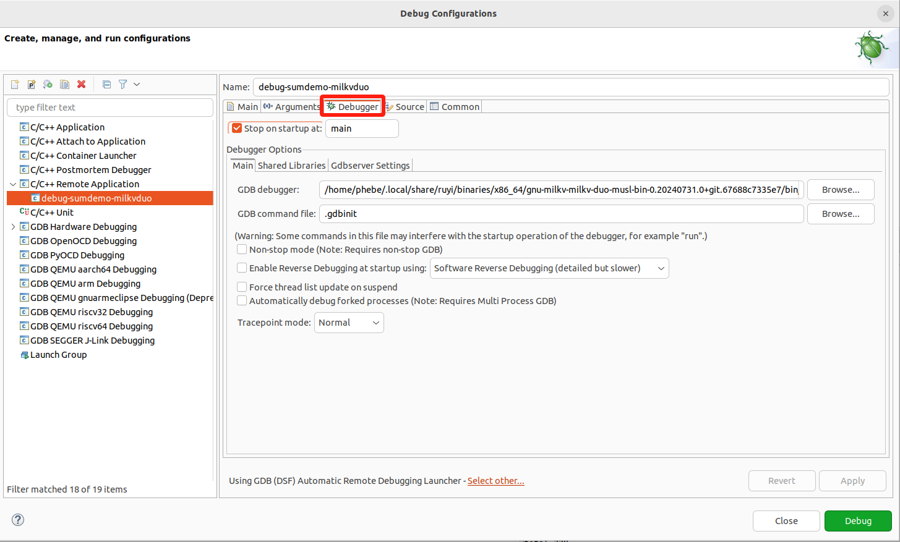

# Milkv Duo: Compiling, Running, and Debugging Using the riscv64-unknown-linux-musl-bin Toolchain

## Setting Up the Compilation Environment

1. Install the RuyiSDK package manager [Reference](/docs/Package-Manager/installation)
2. Install the gnu-milkv-milkv-duo-musl compiler

   ```bash
   # View resources in the software repository
   ruyi list

   # Install the specified toolchain
   ruyi install gnu-milkv-milkv-duo-bin

   # From the returned information, you can view the installation path, e.g., ~/.local/share/ruyi/binaries/x86_64/gnu-milkv-milkv-duo-bin-0.20240731.0+git.67688c7335e7
   ```
3. Create and use the Duo compilation environment

   ```bash
   # View ruyi pre-configured environments
   # ruyi list profiles

   # Create a virtual environment: toolchain is gnu-milkv-milkv-duo-musl-bin
   ruyi venv -t gnu-milkv-milkv-duo-musl-bin milkv-duo ./venv-milkvduo
   ```

## Developing in the IDE

### Preparing the Source Code

This article uses the application example duo-examples for the milkv-duo development board. Use either of the following methods to obtain the source code:

```bash
# Method 1: git clone
git clone https://github.com/milkv-duo/duo-examples.git

# Method 2: ruyi extract command
ruyi extract milkv-duo-examples
```

### Importing and Setting Project Properties

1. File > New > Project

   
2. Select C/C++ > Makefile Project with Existing Code > Next

   
3. Import the prepared source code:
   - Click Browse > Target source code path
   - Toolchain for Indexer Settings: Select RISC-V Cross GCC
   - Finish

   
4. Project hello-world > Right-click > Properties to configure related properties
   1. Configure the toolchain path for the project

      

      Select the path where the compiler was installed by ruyi install (default is under ~/.local/share/ruyi/binaries/x86_64/), or the bin directory under the created virtual environment.
   2. Set compilation properties

      
5. Edit the Makefile
   - The project's built-in Makefile relies on the envsetup.sh script to pre-set environment variables. In the [vendor documentation practice](https://github.com/milkv-duo/duo-examples/blob/main/README-zh.md), we learned that the compiler prefix, compilation options, and linking parameters were pre-set. For convenience, these are written directly into the Makefile. Note that the TOOLCHAIN_PREFIX path needs to be modified as needed.
   - Compilation parameters:
     - `-mcpu=c906fdv`: Specifies the target CPU model for cross-compilation
     - `-march=rv64imafdcv0p7xthead`: Specifies the target architecture for cross-compilation
     - `-g`: Generates debugging information
   - To automate copying the target program to the target device, the Makefile also includes an upload target (this assumes SSH authentication between the PC and the target device; refer to the "SSH Key Configuration" section at the end). Additionally, the relevant directory must be pre-created on the target device (the storage path is customizable, but ensure the scp command path matches the actual environment).
   - You can further modify the Makefile below; this is just a reference.

   ```makefile
   # Eclipse toolchain settings
   # TOOLCHAIN_PREFIX := ~/milkv/duo/duo-examples/host-tools/gcc/riscv64-linux-musl-x86_64/bin/riscv64-unknown-linux-musl-
   TOOLCHAIN_PREFIX := ~/.local/share/ruyi/binaries/x86_64/gnu-milkv-milkv-duo-musl-bin-0.20240731.0+git.67688c7335e7/bin/riscv64-unknown-linux-musl-

   # Compilation options -O3
   # CFLAGS := -mcpu=c906fdv -march=rv64imafdcv0p7xthead -mcmodel=medany -mabi=lp64d -DNDEBUG -I/home/phebe/milkv/duo/duo-examples/include/system
   # LDFLAGS := -D_LARGEFILE_SOURCE -D_LARGEFILE64_SOURCE -D_FILE_OFFSET_BITS=64 -L/home/phebe/milkv/duo/duo-examples/libs/system/musl_riscv64
   CFLAGS := -mcpu=c906fdv -march=rv64imafdcv0p7xthead -g  # -mcpu=c906fdv -march=rv64imafdcv0p7xthead: One of the two must be set
   LDFLAGS :=

   TARGET=helloworld

   ifeq (,$(TOOLCHAIN_PREFIX))
   $(error TOOLCHAIN_PREFIX is not set)
   endif

   ifeq (,$(CFLAGS))
   $(error CFLAGS is not set)
   endif

   CC = $(TOOLCHAIN_PREFIX)gcc

   SOURCE = $(wildcard *.c)
   OBJS = $(patsubst %.c,%.o,$(SOURCE))

   # Default target
   all: $(TARGET)

   $(TARGET): $(OBJS)
   	$(CC) $(CFLAGS) -o $@ $(OBJS) $(LDFLAGS)

   %.o: %.c
   	$(CC) $(CFLAGS) -o $@ -c $<

   # Upload target
   upload: $(TARGET)
   	scp $(TARGET) root@192.168.42.1:/root/target/$(TARGET)

   .PHONY: clean upload
   clean:
   	rm -f *.o $(TARGET)

   # Make 'all' target depend on 'upload' to automatically upload after building
   all: upload
   ```
6. Open a Terminal window in the IDE, create an SSH Terminal to log into the target device and perform related operations. If needed, you can also create a Local Terminal window for combined use. This depends on personal preference. Specific steps:
   - Window > Show View > Terminal
   - Terminal: Open a new Terminal View/Open a Terminal > SSH Terminal > Enter Host, User, Password (milkvduo's root password is: milkv) as shown below:

     

     

     

     
   - Pre-create the target file transfer path to match the scp command path in the Makefile. (After building, the target program will appear in the directory.)

     

### Executing the Build

After preparing the above configurations and modifications, right-click the project and click "Build Project". If the build is successful:
1. The Console window shows no errors.

   
2. The SSH Terminal window shows the successfully transferred helloworld target program.

   

### Transferring the Target Program to the Target Device

- If the upload target is defined in the Makefile, the target program transfer is already completed during the "Build Project" step.
- If the upload target is not defined in the Makefile, you can manually execute `scp helloworld root@192.168.42.1:/root/target/` to transfer the target program.

### Running the Target Program and Displaying Execution Results

There are multiple ways to run the target program in the IDE. Choose based on your habits and needs. Here are some methods I have tried; more methods are welcome.

#### SSH Terminal

You can view and run the helloworld target program in the SSH Terminal window:


#### C/C++ Remote Application

Steps: Right-click the project > Run As > Run Configurations > C/C++ Remote Application

Refer to the image below (the image is a screenshot in Debug mode; since the configuration is the same, it is used to explain the key points). Configure the relevant parameters as follows:
- Project: Default, i.e., the target program name
- C/C++ Application: Also defaults to the target program name (Search Project to specify)
- Connect: New > SSH
- Remote Absolute File Path for C/C++ Application: Enter the absolute path of the target program on the RISC-V device (must match the path in the Makefile upload scp command)
- Skip download to target path: It is recommended to check this in the current version and use the upload target in the Makefile to transfer the target program from the host to the target board. This is because, without checking, the IDE requires the RSE (Remote System Explorer) plugin, and the target device system must support sftp-server. Currently, milkvduo does not support sftp-server, so this feature is temporarily unavailable.




Running effect demonstration:
- [Successful remote run with Skip download to target path checked](image/run1.gif)
- [Error when running without Skip download to target path checked](image/run1.gif)

  > milkv duo img currently does not support sftp: https://github.com/milkv-duo/duo-buildroot-sdk/issues/167. This issue will be resolved when the milkvduo image supports sftp-server.

### Debugging

#### Preparing the Debugging Example

The helloworld example is not ideal for debugging. To demonstrate debugging, breakpoints, and single-step tracking, another example is used here.

sumdemo.c

```c
#include <stdio.h>

int Sum(int s, int e)
{
    int result = 0;
    for(int i = s; i <= e; i++)
    {
        result += i;
    }
    return result;
}

int main()
{
    int start = 1;
    int end = 10;
    printf("I will begin\n");
    int n = Sum(start, end);
    printf("running done, result is: [%d-%d]=%d\n", start, end, n);
    return 0;
}
```

Makefile:

```makefile
# Eclipse toolchain settings
# TOOLCHAIN_PREFIX := ~/milkv/duo/duo-examples/host-tools/gcc/riscv64-linux-musl-x86_64/bin/riscv64-unknown-linux-musl-
TOOLCHAIN_PREFIX := ~/.local/share/ruyi/binaries/x86_64/gnu-milkv-milkv-duo-musl-bin-0.20240731.0+git.67688c7335e7/bin/riscv64-unknown-linux-musl-

# Compilation options -O3 -static
# CFLAGS := -mcpu=c906fdv -march=rv64imafdcv0p7xthead -mcmodel=medany -mabi=lp64d -DNDEBUG -I~/milkv/duo/duo-examples/include/system
# LDFLAGS := -D_LARGEFILE_SOURCE -D_LARGEFILE64_SOURCE -D_FILE_OFFSET_BITS=64 -L/home/phebe/milkv/duo/duo-examples/libs/system/musl_riscv64
CFLAGS := -march=rv64imafdcv0p7xthead -g
LDFLAGS :=

TARGET=sumdemo

ifeq (,$(TOOLCHAIN_PREFIX))
$(error TOOLCHAIN_PREFIX is not set)
endif

ifeq (,$(CFLAGS))
$(error CFLAGS is not set)
endif

CC = $(TOOLCHAIN_PREFIX)gcc

SOURCE = $(wildcard*.c)
OBJS = $(patsubst%.c,%.o,$(SOURCE))

# Default target
all: $(TARGET)

$(TARGET): $(OBJS)
   $(CC)$(CFLAGS) -o $@$(OBJS)$(LDFLAGS)

%.o: %.c
   $(CC)$(CFLAGS) -o $@ -c $<

# Upload target
upload: $(TARGET)
   scp $(TARGET) root@192.168.42.1:/root/target/$(TARGET)

.PHONY: clean upload
clean:
   rm -f *.o $(TARGET)

# Make 'all' target depend on 'upload' to automatically upload after building
all: upload
```

#### Preparing gdbserver

The original buildroot image does not come with gdbserver. You can copy the original gdbserver executable or use RuyiSDK to add gdbserver and rebuild the image.

1. Download the original gdbserver executable: https://github.com/milkv-duo/duo-buildroot-sdk/blob/develop/ramdisk/rootfs/public/gdbserver/riscv_musl/usr/bin/gdbserver
2. Copy the downloaded gdbserver to the milkv duo device's path:

   ```bash
   scp gdbserver root@192.168.42.1:/usr/bin/
   ssh root@192.168.42.1 "chmod +x /usr/bin/gdbserver"
   ```

#### Debugging in Terminal

This operation is no different from debugging using the OS Terminal. Those accustomed to using commands can try this.

Terminal supports Local Terminal and SSH Terminal, among others. You can open a Local Terminal and an SSH Terminal connected to milkv duo for operations.

Steps for remote debugging using GDBServer + GDB commands:
1. On the milkvduo device (operate in the helloworld directory):

   ```
   [root@milkv-duo]~/target# gdbserver :2345 ./sumdemo
   Process ./sumdemo created; pid = 1802
   Listening on port 2345
   ```
2. On the PC (operate in the helloworld.c directory):

   ```
   cd ~/ews-milkvduo-t01/sumdemo

   # Check gdb version, start debugging
   # Use the ruyi virtual environment for debugging, activate the virtual environment, and compile in the virtual environment
   source ~/venv-milkvduo/bin/ruyi-activate
   riscv64-unknown-linux-musl-gdb --version
   riscv64-unknown-linux-musl-gdb ./sumdemo

   target remote 192.168.42.1:2345   # Port number must match the gdbserver side

   break sumdemo.c:8                 # Set a breakpoint at line 8

   # The following are commonly used; use as needed
   c                                 # Continue, resume program execution until the next breakpoint
   disp result                       # Track a variable, display its value each time it stops
   print result                      # Print the internal variable result
   ```


[Local Terminal + SSH Terminal | GDBServer + GDB Debugging Demonstration](image/gdb-terminal-1.gif)

#### C/C++ Remote Application

Refer to the image below to configure the relevant parameters. Key points:
- Project: Default, i.e., the target program name
- C/C++ Application: Also defaults to the target program name (Search Project to specify)
- Connect: New > SSH
- Remote Absolute File Path for C/C++ Application: Enter the absolute path of the target program on the RISC-V device (must match the path in the Makefile upload scp command)
- Skip download to target path: It is recommended to check this in the current version and use the upload target in the Makefile to transfer the target program from the host to the target board. This is because, without checking, the IDE requires the RSE (Remote System Explorer) plugin, and the target device system must support sftp-server. Currently, milkvduo does not support sftp-server, so this feature is temporarily unavailable.
- Debugger > Main > GDB Debugger: Specify the GDB path. In this example, use `~/.local/share/ruyi/binaries/x86_64/gnu-milkv-milkv-duo-musl-bin-0.20240731.0+git.67688c7335e7/bin/riscv64-unknown-linux-musl-gdb`
- Debugger > GDB > GDBserver setting: Specify GDBServer and communication port







As with running, since milkv duo currently does not support sftp-server, the remote transfer function for the target program is unavailable, and execution will result in the following error.


Checking Skip download to target path skips downloading the target program, bypassing this issue. Use the upload definition in the Makefile to complete the target program transfer from the host to the target device during the build phase.


Running effect demonstration:
- [Error when running without Skip download to target path checked](image/gdb-withdownload.gif)
- [Successful run with Skip download to target path checked](image/gdb-withoutdownload.gif)

## Additional Notes

### SSH Key Configuration

Here is a detailed explanation of SSH key configuration:

By configuring SSH keys for the host and Milkv Duo, you can enable password-less login, allowing automatic connection and transfer of binary files to the specified directory on the Milkv Duo after building.

Execute ssh-keygen on the host.
Add the public key to the Milkv Duo:

```

#cat ~/.ssh/id_rsa.pub | ssh username@milkv_duo_ip_address 'mkdir -p ~/.ssh && cat >> ~/.ssh/authorized_keys'

cat ~/.ssh/milkvduo.pub | ssh root@192.168.42.1 'mkdir -p ~/.ssh && cat >> ~/.ssh/authorized_keys'
```

Verify: ssh root@192.168.42.1

If successful, you will no longer need to enter a password.
