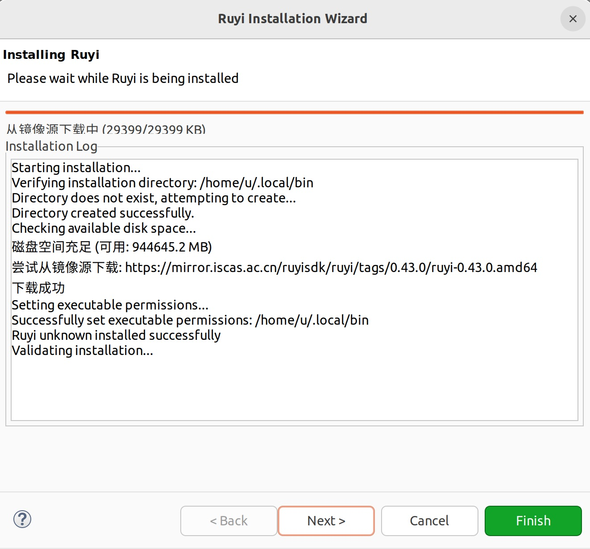
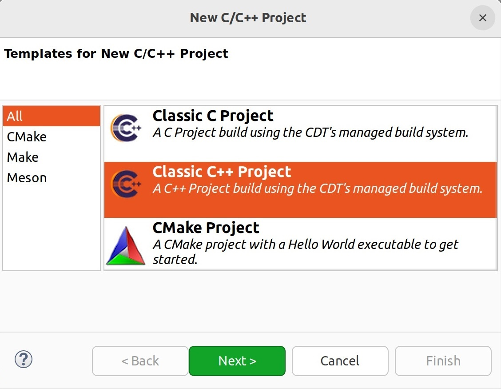
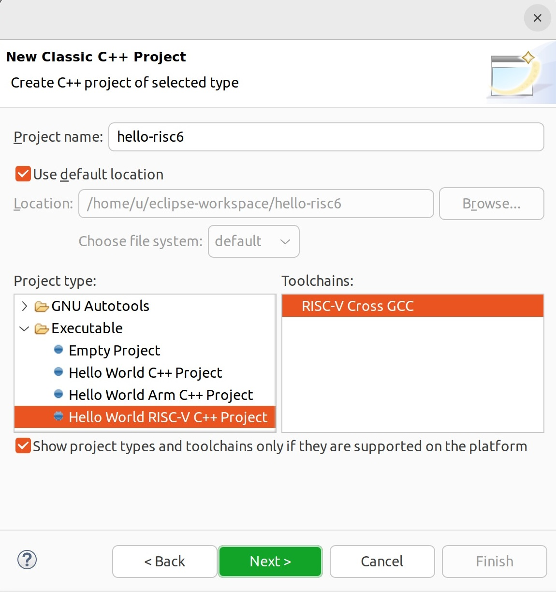
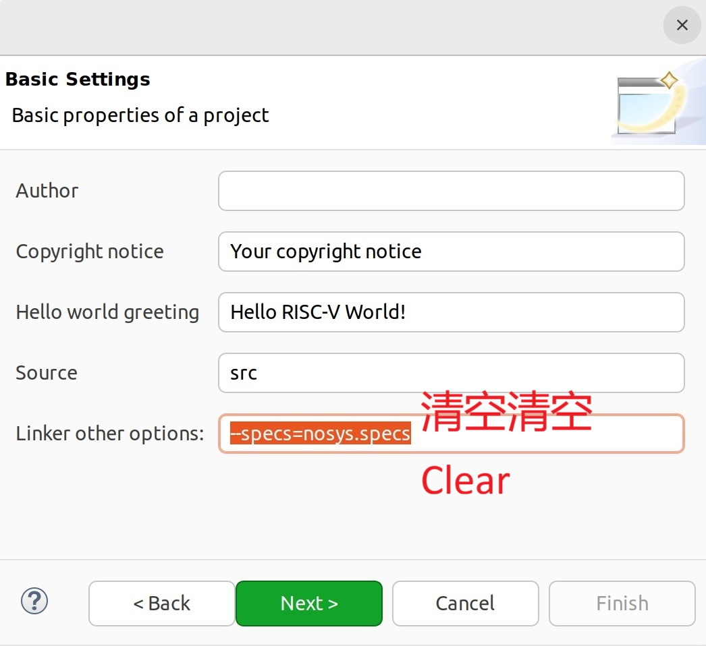
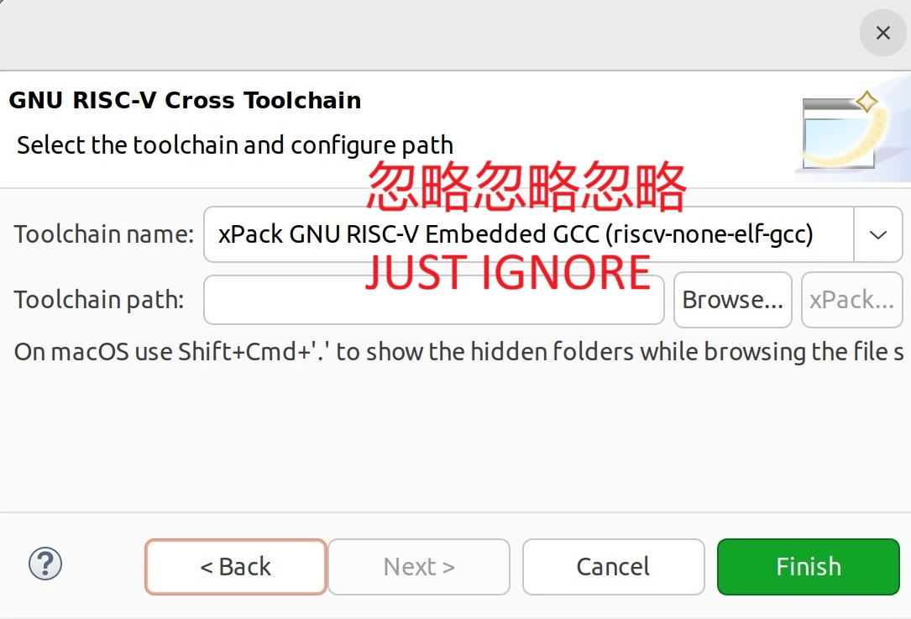
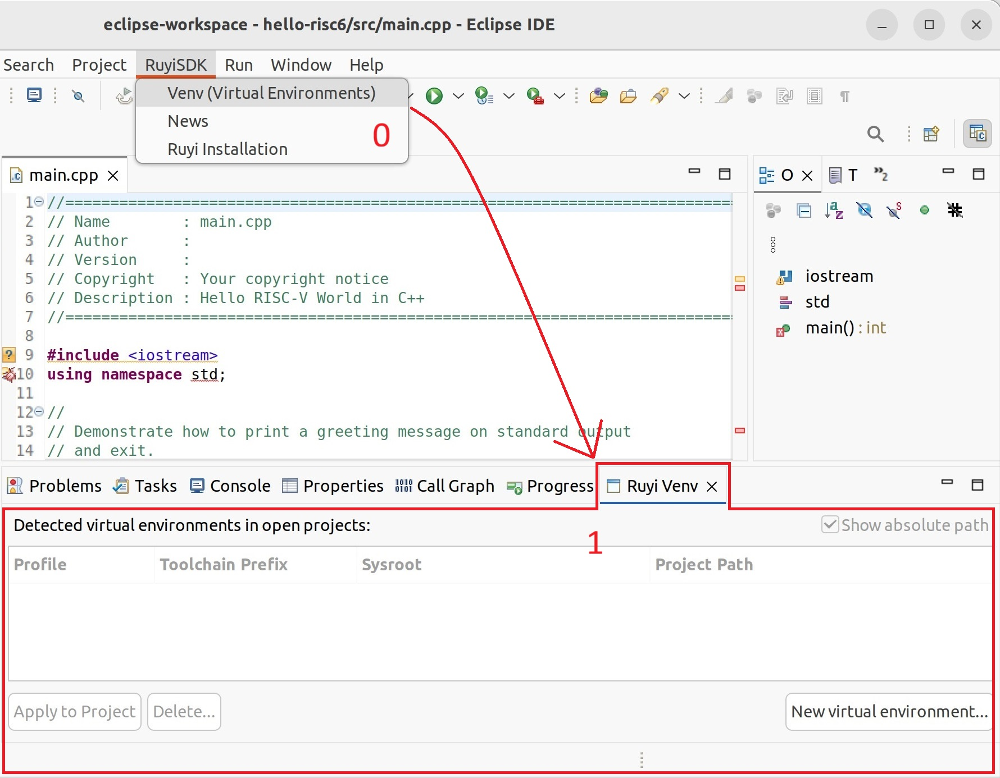
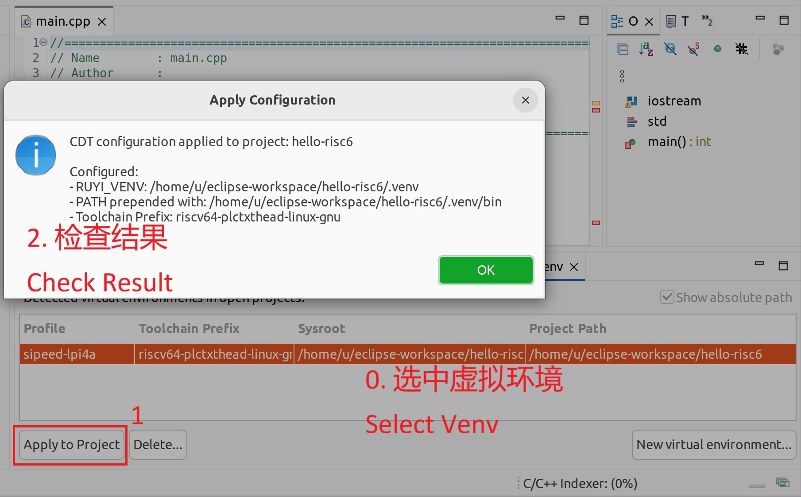

# Sipeed Lichee Pi 4A: Building a Hello World Project in RuyiSDK IDE

## Test Environment

- Operating System: Ubuntu 22.04.5 x86_64

- IDE: Eclipse IDE for Embedded C/C++ Developers 2025.12

## Installing the Ruyi Package Manager via IDE

Launch the IDE, expand the top menu bar "RuyiSDK", and click "Ruyi Installation" to open the installation wizard. Follow the instructions to complete the setup. After installation, expand the "File" menu and click "Restart" to restart the IDE.



## Creating a C/C++ Project in the IDE

Launch the IDE, expand the top menu bar "File"- "New", and in the "C/C++ Project" window click the "Classic C++ Project" wizard.



On the "New Classic C++ Project" page, under "Project type", select "Executable" – "Hello World RISC-V C++ Project", and under "Toolchains" choose "RISC-V Cross GCC".



Clear the linker parameters provided in the "Basic Settings" page under "Linker other options".



On the "GNU RISC-V Cross Toolchain" page, no configuration is required—simply click "Finish".



At this point, the project may fail to build.

## Creating a Virtual Environment for the New Project

Expand the top menu bar "RuyiSDK" and click "Venv (Virtual Environments)" to open the "Ruyi Venv" view.



Click "New virtual environment..." in the view to open the "New virtual environment" window. In "Profiles", select "sipeed-lpi4a"; in "Toolchains", choose the latest "gnu-plct-xthead"; check "Enable" on the right side of "Emulators" and select the latest "qemu-user-riscv-xthead". After completing the selections, click "Next >".


Verify the information in "Summary". In "Venv Name", give the new virtual environment a name, and in "Venv Path", select the path of the project you just created. After filling in the information, click "Finish".


After a short while, the window will close automatically, and the newly created virtual environment will appear in the table of the "Ruyi Venv" view.

## Applying the Virtual Environment and Building the Project

In the "Ruyi Venv" view, select the newly created virtual environment and click "Apply to Project".



In "Project Explorer", right‑click the project and click "Build Project".


The project builds successfully, generating an executable file with the ".elf" extension.

## Running the Built Program with QEMU

Currently, the program can only be executed manually. Users may modify the command as needed.

In "Project Explorer", right‑click the project, expand "Show in Local Terminal", click "Terminal" to open a terminal, and run the following commands:

    ```bash input="1,2,4"
    $ source ./.venv/bin/ruyi-activate
    «Ruyi .venv» $ ruyi-qemu ./Debug/hello-risc5.elf
    Hello RISC-V World!
    «Ruyi .venv» $
    ```


The program executes successfully.
