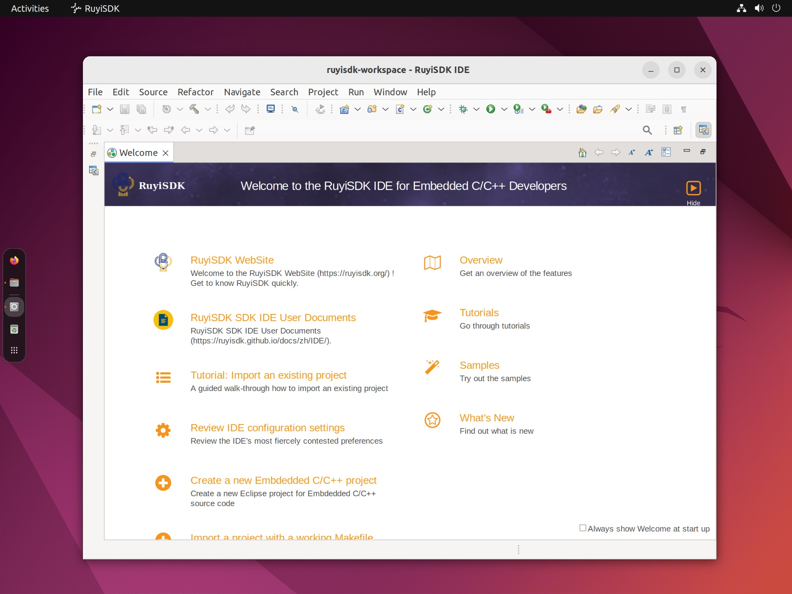
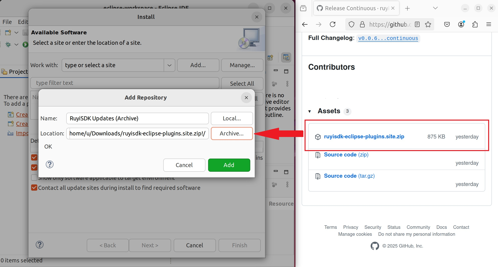

# Overview

## Introduction

RuyiSDK IDE is a graphical integrated development environment built on the open-source Eclipse Embedded CDT, primarily designed for RISC-V developers. The tool inherits Eclipse’s strong support for embedded development and is planned to gradually integrate SDKs for multiple mainstream RISC-V development boards, establishing a RuyiSDK‑featured RISC-V development environment that benefits software developers.

## Download

RuyiSDK IDE download address:  https://fast-mirror.isrc.ac.cn/ruyisdk/ide/0.0.3/ (Do not remove the trailing slash)

This IDE supports three architectures: x86_64, aarch64, and riscv64. Please select according to your current development environment. The IDE already includes a JRE, so you do not need to configure a separate Java environment.

## Launch

1. Extract the tar.gz  package, then double‑click `ruyisdk` in the extracted ruyisdk folder to start the IDE.

2. Choose a folder as the IDE workspace (Workspace). If this is your first time using the IDE, you can select a new folder; if you want to continue your previous development, enter the path of an existing workspace.

3. After selecting the workspace, click the `Launch` button to enter the IDE.

## Install Plugins

To use the full RuyiSDK environment, you need to install the RuyiSDK IDE plugins. Please follow the instructions in the plugin repository to configure them: https://github.com/ruyisdk/ruyisdk-eclipse-plugins/releases/tag/continuous

We are currently refining and integrating plugins into the RuyiSDK IDE project, and will soon provide a more convenient way to install and use it.

## Use Case

- [Sipeed Lichee Pi 4A: Building a Hello World Project in RuyiSDK IDE](./cases/sipeed-lpi4a-ide-hello-world.md)

The RuyiSDK IDE documentation is based on Ubuntu 22.04 LTS x86_64 as an example. If you encounter issues when using other versions of Ubuntu or different distributions, you are welcome to submit screenshots and error messages to the [RISC-V Developer Community](https://ruyisdk.cn/) or our [code repository](https://github.com/ruyisdk/ruyisdk-eclipse-plugins/issues). Thank you for contributing to the RISC-V ecosystem!

## Update

RuyiSDK IDE is continuously evolving. When launching a new version of the IDE, you can safely select your existing workspace to continue development. Our documentation will be updated along with the IDE, and we recommend using the latest version to benefit from new features and bug fixes.
