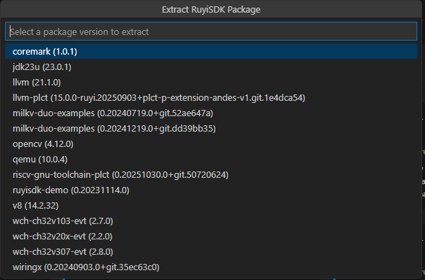

# Extract RuyiSDK Package

In the VS Code Explorer, right‑click the target folder and select **Extract RuyiSDK Package** to directly download and unpack official examples or source packages.

## Typical Workflow

1. Prepare a working directory, then right‑click and choose **Extract RuyiSDK Package**.
2. Select the package to extract (e.g., `coremark`, `ruyisdk-demo`).
3. After extraction, follow the project’s README to build and run.

## Tips

- It is recommended to first install the required toolchain in **Packages**, then create and activate a virtual environment before building.
- For build examples, see[CoreMark (Example: LicheePi 4A)](./cases/case1.md).
- For flashing or image deployment, refer to the relevant cases in the Ruyi Package Manager documentation. The extension does not currently provide a flashing wizard.
