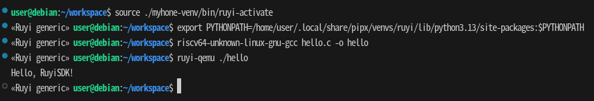

# Feature Overview

- Package Management: Browse, search, install, and uninstall Ruyi packages from the VS Code sidebar.
- Virtual Environments: Create and activate Ruyi venvs with a wizard; terminals and build tools automatically inherit the environment.
- News & Status Bar: Access news from the status bar, view indicators, and switch the current virtual environment.
- Source Package Extraction: Right‑click in the Explorer to quickly download and unpack official examples or source packages.

    

For detailed instructions, please refer to the respective subpages under “User Guide”（[Packages](packages)、[Virtual Environments](venv)、[News](news)、[Extract RuyiSDK Package](extract)）.


## Interface Highlights

- Entry Point: The **Ruyi** icon in the sidebar Activity Bar provides access to the Packages and Virtual Environments views; the bottom status bar displays the current virtual environment and the news entry.
- Virtual Environments: Click a virtual environment in the list to activate it. The integrated terminal and CMake/Meson builds will then inherit the PATH and cross‑compilation settings (from files such as toolchain.cmake and meson-cross.ini in the venv directory).

## Development Workflow Example

The following example demonstrates how to use the extension in VS Code to complete a minimal RISC-V cross‑compilation and execution process, making it easy to get started quickly.

### Hello World: Minimal Cross‑Compilation and Execution with Extension

1. In the Packages view, install the `gnu-upstream` toolchain (optionally install `qemu-user-riscv-upstream` for local simulation).
2. In the Virtual Environments view, click `+`, select the `generic` Profile, choose the `gnu-upstream` toolchain, specify a name and path, then create and activate the virtual environment.
3. In the workspace, create a new file `hello.c` with the following content:

```c
#include <stdio.h>
int main() {
    printf("Hello, RuyiSDK!\n");
    return 0;
}
```

4. Open the VS Code terminal (with the venv activated) and execute the build and run:

```bash input="1,2"
riscv64-unknown-linux-gnu-gcc hello.c -o hello
ruyi-qemu ./hello
```

> Currently, installing Ruyi via pipx has known issues（see https://github.com/ruyisdk/ruyisdk/issues/414）.
If you are using the extension installed with pipx, you must first run `pipx ensurepath` and restart the terminal to ensure `ruyi-qemu` is available. In addition, set the `PYTHONPATH` environment variable to point to the pipx Ruyi installation path, for example: `export PYTHONPATH="$HOME/.local/pipx/venvs/ruyi/lib/python3.x/site-packages:$PYTHONPATH"`

If the output is `Hello, RuyiSDK!`, the build and run were successful.



#### Notes

- If not using QEMU, you can deploy the executable to the target device for execution. Refer to the official documentation or relevant case studies for deployment methods.
- For more complex builds (such as CoreMark), please refer to [CoreMark (Example: LicheePi 4A)](./cases/case1.md).

## More Information

- Extension repository and issue tracker: [https://github.com/ruyisdk/ruyisdk-vscode-extension](https://github.com/ruyisdk/ruyisdk-vscode-extension)
- RuyiSDK official site: [https://ruyisdk.org/](https://ruyisdk.org/)
