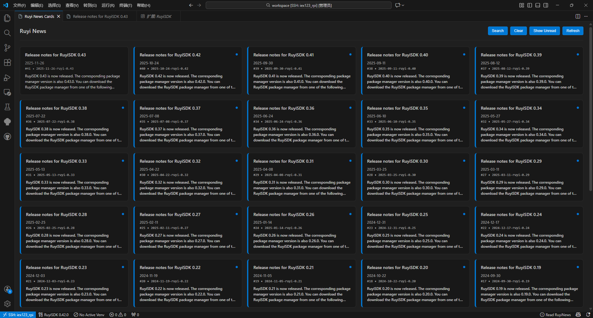
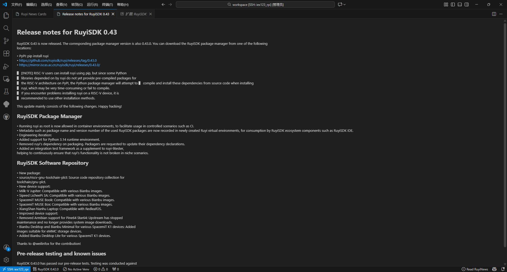
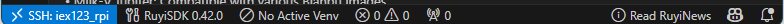

# News and Status Bar

## News Panel

- Entry Point: Access via the news icon in the status bar, or from the command palette with `Ruyi: Show News Cards`.
- Card‑style Browsing: Clear unread indicators, with support for search and filtering.
- Card Details: Click a card to read the full Markdown content.

| | |
| --- | --- |
|  |  |

## Status Bar

- Displays the name of the currently active virtual environment, with quick switching available by clicking.
- Provides access to the news panel and shows status notifications during certain operations (such as detection or installation).

