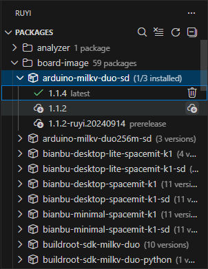

# Managing Ruyi Packages

The extension’s **Packages** view provides a visual interface for package management:

- Category Browsing: Packages are grouped by category; expand a package name to view all versions.
- Search & Refresh: Toolbar buttons support filtering by name or category and refreshing the list.
- Install/Uninstall: Behavior is consistent with the CLI; status updates in real time. Installed versions are marked with a green check.

Note: Package sources, naming, and versioning follow the same conventions as the CLI. For detailed functionality, see [Ruyi Package Manager](/en/docs/Package-Manager).

## Common Operations

- Install a toolchain: Select the target version (e.g., `gnu-upstream`) from the list and click Install.
- Uninstall a toolchain: Click Uninstall on an installed version.
- Refresh the list: Use the toolbar refresh button or run `Ruyi: Refresh Package List` from the command palette.

If network access is restricted, configure a mirror source for Ruyi in the terminal first, then return to the extension for installation and updates. For CLI configuration methods, see [installation](/en/docs/Package-Manager/installation).
