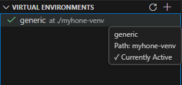

# Virtual Environments

Create and manage Ruyi virtual environments in VS Code through a guided wizard, integrated with the terminal and build tools.

## Create and Activate

- Click the **Ruyi** icon in the sidebar > **Virtual Environments** view, then click `+`.
- Select a Profile (e.g., `generic`, `sipeed-lpi4a`, `milkv-duo`).
- Check the toolchains (multiple selections allowed), optionally configure a simulator.
- Specify a name and path, then complete creation.
- Click the environment name in the list to activate/deactivate; the status bar will show the currently active environment.

> Once activated, the VS Code terminal inherits the virtual environment’s PATH and cross‑compilation settings. The venv directory contains files such as `toolchain.cmake` and `meson-cross.ini`, which can be used directly by CMake/Meson.

## Tips

- Before creating, install the required toolchains/simulators in the **Packages** view.
- The virtual environment concept is consistent with CLI behavior. For more details, see [Using Integration Features](../Package-Manager/intergration.mdx).
