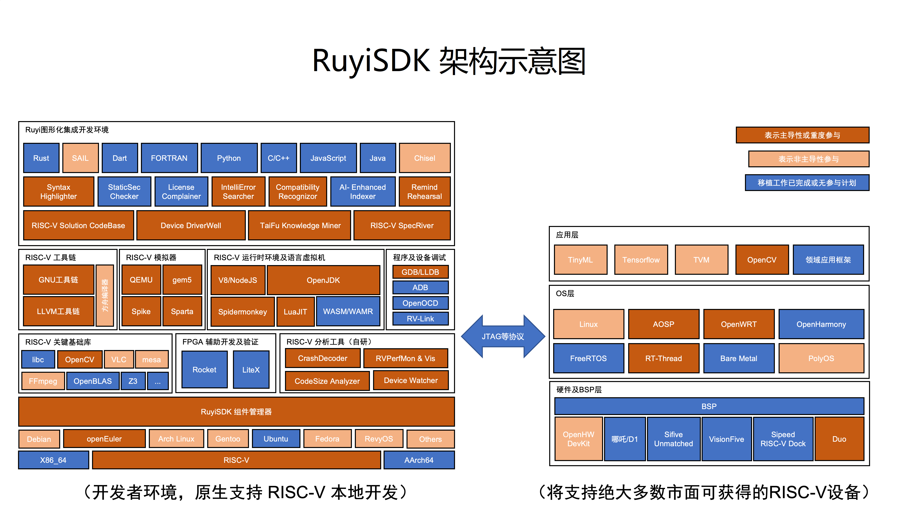

# Hello Ruyi

Welcome to the introduction of [RuyiSDK](https://github.com/ruyisdk). Below are the key topics covered in this document:

> 1. What is RuyiSDK -> Introduction
> 2. Why RuyiSDK exists -> Background
> 3. What can RuyiSDK do -> Features
> 4. On which devices can I run it -> Supported Devices
> 5. How does RuyiSDK work -> RuyiSDK Architecture Diagram
> 6. Where should I start -> Let's Get Started!

## Introduction

RuyiSDK is an open-source project led by the Institute of Software, Chinese Academy of Sciences (ISCAS). The project aims to provide RISC-V developers with a convenient and comprehensive development environment. It offers up-to-date hardware information and software support—for example, supported devices include corresponding hardware details; on the software side, it provides images (such as [RevyOS](https://github.com/ruyisdk/revyos)), toolchains, package managers, and more.

The ultimate goal is to create a robust and user-friendly development environment for RISC-V developers, promoting RISC-V as a mainstream architecture. Additionally, it aims to build and maintain a thriving community for developer collaboration. Ultimately, RuyiSDK aspires to go global, offering development convenience to RISC-V developers worldwide.

## Background

RISC-V is the fifth-generation reduced instruction set architecture, an open-source project initiated by the University of California, Berkeley. Compared to CISC, it is more streamlined and offers higher instruction execution efficiency. Its open-source nature allows for easier adoption across various fields, including IoT, smart home devices, chip design, operating systems, and software development.

Historically, RISC-V development faced challenges due to the lack of a unified platform for information, significantly reducing the efficiency of learning and application development. RuyiSDK was created to address these issues.

## Features


RuyiSDK is divided into the following three components:

### [Ruyi Package Manager](/docs/category/ruyi-包管理器)

This package manager is an online software repository that provides the following:

```
1. Toolchains
2. Debugging tools
3. Simulators
4. Runtime environments
5. Documentation
6. Source code
7. Tools and system images
8. GUI (TODO)
```

### [Ruyi IDE](/docs/category/ruyisdk-ide)

This IDE is a development toolbox designed for the RISC-V architecture. Developers can easily obtain it through the Ruyi package manager, enabling efficient code writing and debugging for real-world development scenarios. Using the package manager, developers can access toolchains, debugging tools, and simulators, allowing them to write and debug programs either on simulators or RISC-V development boards.

### [Community](/contact)

Our community offers a wealth of technical articles, code, tutorial videos, and offline events to gather user feedback. Additionally, an online forum is available for developers to exchange technical knowledge.

----

RuyiSDK's integration and support for RISC-V devices include the following aspects:

1. Information and tutorials for downloading and installing RISC-V development board images, making it easier for developers to obtain relevant images (essentially providing an image repository). This includes various operating systems (e.g., Debian-based RevyOS, openEuler RISC-V, etc.) for developers to use.
2. Maintenance and download of demonstration programs, development materials, and related tools (including applicable toolchains and simulators) for RISC-V development boards, enabling developers to get started quickly.
3. Adding RISC-V device-specific wizard pages to the integrated development environment, enabling file transfer between development and runtime environments, and supporting application debugging on RISC-V devices.

## Supported Devices

Currently, RuyiSDK [supports the following devices](https://github.com/ruyisdk/support-matrix):

| Model                         |                      |                          |                     |
| ----------------------------- | -------------------- | ------------------------ | ------------------- |
| 100ASK-V853-PRO               | AllWinner V853       | BananaPi BPI-F3          | BeagleV-Ahead       |
| BeagleV-Fire                  | CanMV K230(D)        | Canaan K510-CRB-V1.2 KIT | CH32V103-EVT        |
| CH32V203-EVT                  | CH32V208-EVT         | CH32V303-EVT             | CH32V305-EVT        |
| CH32V307-EVT                  | CH573F-EVT           | CH582F-EVT               | CH592X-EVT          |
| D1s NeZha                     | DongshanPI-Nezha STU | DongShanPI D1s           | HiFive Unmatched    |
| Lichee Cluster 4A             | Lichee Console 4A    | LicheePi 4A              | LicheeRV/AWOL Nezha |
| LicheeRV Nano                 | Longan Nano          | MangoPi MQ               | MangoPi MQ Pro      |
| Milk-V Duo 64M                | Milk-V Duo 256M      | Milk-V Duo S             | Milk-V Mars         |
| Milk-V Meles                  | Milk-V Vega          | Nuclei DDR200T           | Pioneer Box         |
| PolarFire FPGA SoC Icicle Kit | RV-STAR              | Sipeed Maix-Bit          | Sipeed M0 sense     |
| Sipeed M0P Dock               | Sipeed M0s Dock      | Sipeed M1s Dock          | Star64              |
| Tang Mega 138K                | TinyVision           | VisionFive               | VisionFive 2        |
| YuzukiHD-Lizard               |                      |                          |                     |

> The documentation may not always be up-to-date. To check the latest supported devices, use the command `ruyi device provision`.

## RuyiSDK Architecture Diagram



## Let's Get Started!

Start using RuyiSDK with your device!

### Obtain and Install Ruyi

For detailed instructions, refer to [here](/docs/Package-Manager/installation).

### Obtain and Install OS

First step:

```bash
$ ruyi device provision
```

> This command identifies hardware information and automatically executes the corresponding program to deploy the RISC-V development environment for the user. Follow the prompts step by step.

For detailed instructions, refer to [Flashing a Development Board Using dd (Using MilkV Duo as an Example)](/docs/Package-Manager/cases/case3) and [Flashing a Development Board Using fastboot (Using Licheepi 4A as an Example)](/docs/Package-Manager/cases/case4).
